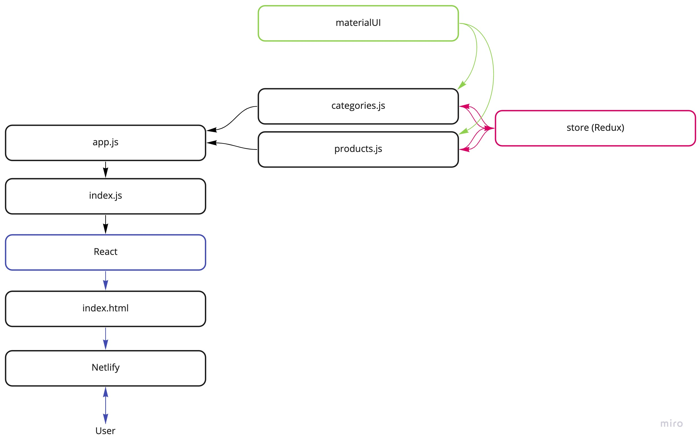

# LAB - Week 8

## Project: Storefront

### Author: Brendan Smith

### Description
	A React web application using Redux for state management, React-router for routing, Axios for network requests, deployed on Github Pages. An Express api server is deployed on Heroku, using MongoDB for data persistence. 

### Links and Resources

- [deployed site](https://www.brendansmith.dev/storefront/)
- [Pull Request: Additional Topics](https://github.com/brendigler/storefront/pull/4)
- [Pull Request: Asynchronous Actions](https://github.com/brendigler/storefront/pull/3)
- [Pull Request: Combined Reducers](https://github.com/brendigler/storefront/pull/2)
- [Pull Request: Application State with Redux](https://github.com/brendigler/storefront/pull/1)

### Setup

#### `.env` requirements

- none

#### How to initialize/run your application

- clone to local repo
- `npm install`
- `npm start`

<!-- #### Tests -->

<!-- - Run tests with `npm test` -->

<!-- #### UML / Application Wiring Diagram -->

